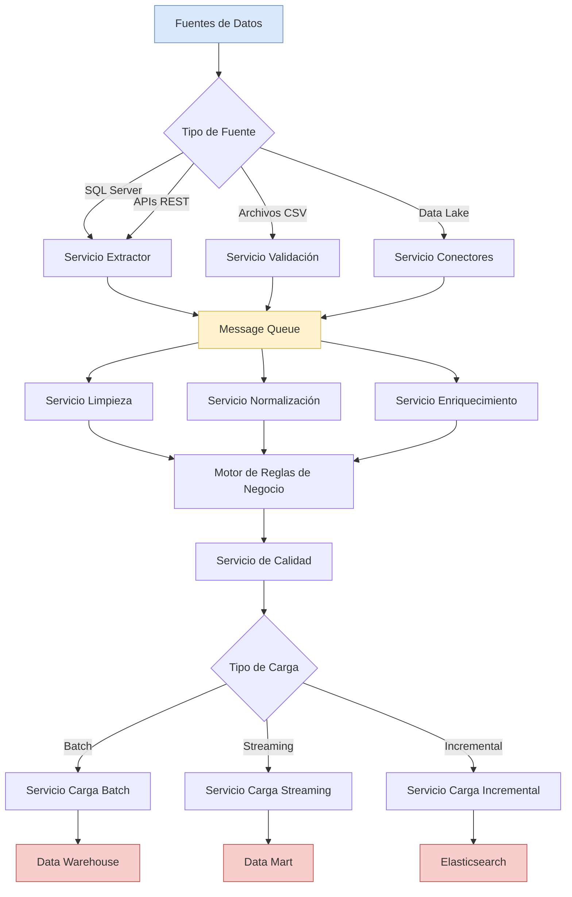

# Arquitectura Orientada a Servicios (SOA) - Proceso ETL Escalable

## Tabla de Contenidos
- [Descripción General](#descripción-general)
- [Diagrama de Arquitectura](#diagrama-de-arquitectura)
- [Diagrama de Flujo del Proceso ETL](#diagrama-de-flujo-del-proceso-etl)
- [Componentes de la Arquitectura](#componentes-de-la-arquitectura)
- [Justificación Técnica](#justificación-técnica)
- [Código de Extracción](#código-de-extracción)
- [Tecnologías Recomendadas](#tecnologías-recomendadas)
- [Patrones de Diseño Aplicados](#patrones-de-diseño-aplicados)
- [Escalabilidad y Rendimiento](#escalabilidad-y-rendimiento)

---

## Descripción General

Este proyecto presenta una **Arquitectura Orientada a Servicios (SOA)** diseñada específicamente para soportar un proceso ETL (Extract, Transform, Load) escalable y robusto. La arquitectura está diseñada para manejar múltiples fuentes de datos heterogéneas y procesarlas de manera eficiente utilizando microservicios independientes y desacoplados.

### Objetivos Principales
- Escalabilidad horizontal para manejar grandes volúmenes de datos
- Flexibilidad para integrar nuevas fuentes de datos sin afectar servicios existentes
- Tolerancia a fallos mediante redundancia y recuperación automática
- Procesamiento distribuido para optimizar tiempos de ejecución
- Comunicación asíncrona entre servicios para mejorar el rendimiento

---

## Diagrama de Arquitectura

La arquitectura se encuentra documentada en el archivo `arquitectura_etl_soa.drawio` y puede ser visualizada usando [Draw.io](https://app.diagrams.net/).

---

## Diagrama de Flujo del Proceso ETL

### Flujo Detallado



### Secuencia de Ejecución

1. **Extracción**: Los datos se extraen de las fuentes mediante servicios especializados
2. **Validación**: Se validan esquemas, tipos de datos y reglas de integridad
3. **Transformación**: Se aplican limpieza, normalización y reglas de negocio
4. **Calidad**: Se verifican métricas de calidad de datos
5. **Carga**: Los datos se cargan en los sistemas de destino según el patrón requerido
6. **Monitoreo**: Se registran métricas y logs en tiempo real

---

## Componentes de la Arquitectura

### 1. Capa de Fuentes de Datos

| Fuente | Tipo | Protocolo | Uso |
|--------|------|-----------|-----|
| **SQL Server** | Relacional | JDBC/ODBC | Datos transaccionales estructurados |
| **APIs REST** | Servicios Web | HTTP/HTTPS | Datos de terceros en tiempo real |
| **Archivos CSV** | Archivos Planos | File System | Carga masiva de datos históricos |

### 2. Capa de Extracción (Extract)

#### Servicio Extractor
- **Función**: Extrae datos de bases de datos relacionales y APIs REST
- **Tecnología**: Python + SQLAlchemy + Requests
- **Patrón**: Adapter Pattern para múltiples fuentes

#### Servicio de Validación
- **Función**: Valida estructura y calidad de archivos CSV
- **Tecnología**: Pandas + Great Expectations
- **Patrón**: Validator Pattern

#### Servicio de Conectores
- **Función**: Gestiona conexiones a Data Lakes y sistemas distribuidos
- **Tecnología**: Boto3 (AWS S3) + PyArrow
- **Patrón**: Factory Pattern para diferentes conectores

#### Servicio de Metadatos
- **Función**: Recolecta y almacena metadatos de esquemas y linaje de datos
- **Tecnología**: Apache Atlas + GraphQL
- **Patrón**: Repository Pattern

### 3. Capa de Transformación (Transform)

#### Servicio de Limpieza de Datos
- Eliminación de duplicados
- Tratamiento de valores nulos
- Corrección de inconsistencias
- **Tecnología**: Apache Spark + PySpark

#### Servicio de Normalización
- Estandarización de formatos
- Conversión de tipos de datos
- Unificación de codificaciones
- **Tecnología**: Pandas + NumPy

#### Servicio de Enriquecimiento
- Agregación de datos externos
- Geocodificación
- Cálculo de métricas derivadas
- **Tecnología**: Python + APIs de Enriquecimiento

#### Servicio de Agregación
- Agrupación de datos
- Cálculos estadísticos
- Generación de resúmenes
- **Tecnología**: Apache Spark SQL

#### Motor de Reglas de Negocio
- Aplicación de lógica de negocio
- Validaciones complejas
- Transformaciones personalizadas
- **Tecnología**: Drools + Python

#### Servicio de Calidad de Datos
- Validación de reglas de calidad
- Métricas de completitud
- Detección de anomalías
- **Tecnología**: Great Expectations + Python

### 4. Capa de Carga (Load)

#### Servicio de Carga Batch
- **Función**: Carga masiva de datos en ventanas programadas
- **Patrón**: Batch Processing
- **Tecnología**: Apache Spark + JDBC Bulk Insert

#### Servicio de Carga Streaming
- **Función**: Carga continua de datos en tiempo real
- **Patrón**: Stream Processing
- **Tecnología**: Apache Kafka + Spark Streaming

#### Servicio de Carga Incremental
- **Función**: Carga solo de datos nuevos o modificados (CDC)
- **Patrón**: Change Data Capture
- **Tecnología**: Debezium + Kafka Connect

#### Servicio de Indexación
- **Función**: Crea índices para búsquedas rápidas
- **Tecnología**: Elasticsearch + Logstash

### 5. Capa de Destinos

| Destino | Tipo | Propósito |
|---------|------|-----------|
| **Data Warehouse** | Snowflake/Redshift | Almacenamiento analítico centralizado |
| **Data Mart** | PostgreSQL | Análisis específico por departamento |
| **Elasticsearch** | Motor de Búsqueda | Búsquedas full-text y analytics |
| **OLAP Cube** | Analysis Services | Análisis multidimensional |
| **Cache (Redis)** | In-Memory DB | Acceso rápido a datos frecuentes |

### 6. Servicios Transversales

#### Orquestación (Apache Airflow)
- Programación y ejecución de workflows
- Gestión de dependencias entre tareas
- Reintentos automáticos en caso de fallo

#### Logging (Python Logging Module)
- Registro de eventos de extracción
- Niveles de log: INFO, WARNING, ERROR
- Formato personalizable con timestamps
- Salida a consola y archivos de log

#### Seguridad (API Keys)
- Autenticación mediante API Keys
- Bearer tokens para APIs REST
- Gestión de credenciales

#### Message Queue (Apache Kafka / RabbitMQ)
- Comunicación asíncrona entre servicios
- Buffer de mensajes
- Garantía de entrega de mensajes

---

## Justificación Técnica

### 1. Arquitectura Orientada a Servicios (SOA)

**Decisión**: Implementar una arquitectura basada en microservicios independientes.

**Justificación**:
- **Desacoplamiento**: Cada servicio puede desarrollarse, desplegarse y escalarse independientemente
- **Mantenibilidad**: Los cambios en un servicio no afectan a otros componentes
- **Reutilización**: Los servicios pueden ser consumidos por múltiples procesos
- **Resiliencia**: El fallo de un servicio no compromete todo el sistema
- **Especialización**: Cada equipo puede especializarse en un servicio específico

### 2. Message Queue (Apache Kafka)

**Decisión**: Utilizar un sistema de mensajería para la comunicación entre servicios.

**Justificación**:
- **Desacoplamiento temporal**: Los productores y consumidores no necesitan estar sincronizados
- **Buffer de carga**: Absorbe picos de tráfico sin saturar servicios downstream
- **Escalabilidad**: Permite escalar productores y consumidores independientemente
- **Persistencia**: Los mensajes se guardan hasta ser procesados correctamente
- **Replay capability**: Posibilidad de reprocesar datos históricos

### 3. Separación de Responsabilidades (Extract/Transform/Load)

**Decisión**: Dividir el proceso ETL en capas independientes.

**Justificación**:
- **Principio de Responsabilidad Única (SRP)**: Cada capa tiene una función específica
- **Facilita el debugging**: Los errores se localizan más fácilmente
- **Optimización independiente**: Cada capa puede optimizarse según sus necesidades
- **Reusabilidad**: Los servicios de transformación pueden usarse para múltiples fuentes
- **Testing**: Permite pruebas unitarias e integración más efectivas

### 4. Procesamiento Distribuido (Apache Spark)

**Decisión**: Utilizar Apache Spark para transformaciones de grandes volúmenes.

**Justificación**:
- **Escalabilidad horizontal**: Distribuye el procesamiento en múltiples nodos
- **Procesamiento in-memory**: 100x más rápido que MapReduce tradicional
- **API unificada**: Soporta batch y streaming con la misma API
- **Optimización automática**: Catalyst optimizer mejora las queries automáticamente
- **Integración**: Se integra fácilmente con Hadoop, S3, Kafka, etc.

### 5. Data Lake como Fuente Central

**Decisión**: Utilizar un Data Lake (S3/HDFS) como repositorio central de datos raw.

**Justificación**:
- **Almacenamiento económico**: Costo por GB significativamente menor que bases de datos
- **Schema-on-read**: Permite almacenar datos sin esquema predefinido
- **Escalabilidad ilimitada**: Crece según las necesidades sin límites
- **Durabilidad**: Replicación automática y alta disponibilidad
- **Versatilidad**: Soporta datos estructurados, semi-estructurados y no estructurados

### 6. Múltiples Patrones de Carga

**Decisión**: Implementar servicios especializados para Batch, Streaming e Incremental.

**Justificación**:
- **Batch**: Ideal para cargas históricas masivas durante ventanas de mantenimiento
- **Streaming**: Necesario para casos de uso en tiempo real (dashboards, alertas)
- **Incremental (CDC)**: Optimiza cargas periódicas procesando solo cambios
- **Eficiencia**: Cada patrón está optimizado para su caso de uso específico
- **Flexibilidad**: Permite elegir la estrategia según requisitos de negocio

### 7. Servicios de Calidad de Datos

**Decisión**: Implementar validaciones de calidad en múltiples etapas.

**Justificación**:
- **Prevención de errores**: Detecta problemas antes de llegar a destino
- **Confianza en datos**: Garantiza que los datos cumplan estándares de calidad
- **Alertas tempranas**: Notifica problemas antes de afectar decisiones de negocio
- **Compliance**: Cumple con regulaciones de calidad de datos (GDPR, SOX, etc.)
- **Métricas**: Genera KPIs sobre la calidad de datos a lo largo del tiempo

### 8. Orquestación con Apache Airflow

**Decisión**: Utilizar Airflow para la orquestación de workflows ETL.

**Justificación**:
- **DAGs (Directed Acyclic Graphs)**: Permite definir dependencias complejas
- **Programación flexible**: Cron expressions, sensores, triggers externos
- **Monitoreo integrado**: UI web para visualizar estado de ejecuciones
- **Reintentos automáticos**: Configuración de políticas de retry por tarea
- **Extensibilidad**: Permite crear operadores personalizados

### 9. Múltiples Destinos Especializados

**Decisión**: Cargar datos en destinos especializados según el caso de uso.

**Justificación**:
- **Data Warehouse**: Optimizado para queries analíticas complejas (OLAP)
- **Elasticsearch**: Ideal para búsquedas full-text y análisis de logs
- **Redis Cache**: Acceso ultra-rápido a datos frecuentemente consultados
- **OLAP Cubes**: Análisis multidimensional con drill-down/roll-up
- **Data Marts**: Subconjuntos especializados para departamentos específicos

### 10. Seguridad con API Keys

**Decisión**: Implementar autenticación mediante API Keys para servicios externos.

**Justificación**:
- **Simplicidad**: Fácil de implementar y mantener
- **API Keys estáticas**: Para APIs REST externas con Bearer tokens
- **Gestión de credenciales**: Almacenamiento seguro en variables de entorno o archivos de configuración
- **HTTPS/TLS**: Encriptación en tránsito para proteger las API Keys
- **Logging**: Registro de accesos para auditoría básica
- **Rotación manual**: Las API Keys se pueden rotar cuando sea necesario

---

## Código de Extracción

### 1. Servicio Extractor - SQL Server

```python
# extractor_service.py
import pyodbc
import pandas as pd
from typing import Dict, Any, List
import logging
from datetime import datetime

class SQLServerExtractor:
    """
    Servicio de extracción de datos desde SQL Server.
    Implementa el patrón Adapter para diferentes fuentes de datos.
    """
    
    def __init__(self, config: Dict[str, Any]):
        """
        Inicializa el extractor con configuración de conexión.
        
        Args:
            config: Diccionario con parámetros de conexión
                   (server, database, username, password)
        """
        self.config = config
        self.logger = logging.getLogger(__name__)
        self.connection = None
        
    def connect(self) -> None:
        """Establece conexión con SQL Server."""
        try:
            connection_string = (
                f"DRIVER={{ODBC Driver 17 for SQL Server}};"
                f"SERVER={self.config['server']};"
                f"DATABASE={self.config['database']};"
                f"UID={self.config['username']};"
                f"PWD={self.config['password']}"
            )
            self.connection = pyodbc.connect(connection_string)
            self.logger.info("Conexión establecida con SQL Server")
        except Exception as e:
            self.logger.error(f"Error al conectar: {e}")
            raise
    
    def extract_table(self, table_name: str, 
                     filters: Dict[str, Any] = None,
                     batch_size: int = 10000) -> pd.DataFrame:
        """
        Extrae datos de una tabla específica con filtros opcionales.
        
        Args:
            table_name: Nombre de la tabla a extraer
            filters: Diccionario con filtros WHERE
            batch_size: Tamaño del lote para lectura por chunks
            
        Returns:
            DataFrame de Pandas con los datos extraídos
        """
        if not self.connection:
            self.connect()
        
        query = f"SELECT * FROM {table_name}"
        
        if filters:
            where_clauses = [f"{k} = '{v}'" for k, v in filters.items()]
            query += " WHERE " + " AND ".join(where_clauses)
        
        try:
            self.logger.info(f"Extrayendo datos de {table_name}")
            df = pd.read_sql(query, self.connection, chunksize=batch_size)
            
            # Combinar todos los chunks
            data = pd.concat(df, ignore_index=True)
            
            self.logger.info(f"Extraídos {len(data)} registros de {table_name}")
            return data
            
        except Exception as e:
            self.logger.error(f"Error al extraer datos: {e}")
            raise
    
    def extract_incremental(self, table_name: str, 
                           timestamp_column: str,
                           last_extraction: datetime) -> pd.DataFrame:
        """
        Extrae solo datos nuevos o modificados desde la última extracción.
        Implementa el patrón Change Data Capture (CDC).
        
        Args:
            table_name: Nombre de la tabla
            timestamp_column: Columna de fecha/hora para filtrar
            last_extraction: Fecha de la última extracción
            
        Returns:
            DataFrame con datos incrementales
        """
        query = f"""
            SELECT * FROM {table_name}
            WHERE {timestamp_column} > ?
            ORDER BY {timestamp_column}
        """
        
        try:
            self.logger.info(f"Extracción incremental de {table_name}")
            df = pd.read_sql(query, self.connection, 
                           params=[last_extraction])
            
            self.logger.info(f"Extraídos {len(df)} registros incrementales")
            return df
            
        except Exception as e:
            self.logger.error(f"Error en extracción incremental: {e}")
            raise
    
    def get_metadata(self, table_name: str) -> Dict[str, Any]:
        """
        Obtiene metadatos de la tabla (esquema, tipos de datos, etc.).
        
        Args:
            table_name: Nombre de la tabla
            
        Returns:
            Diccionario con metadatos
        """
        query = f"""
            SELECT 
                COLUMN_NAME,
                DATA_TYPE,
                CHARACTER_MAXIMUM_LENGTH,
                IS_NULLABLE
            FROM INFORMATION_SCHEMA.COLUMNS
            WHERE TABLE_NAME = '{table_name}'
        """
        
        try:
            cursor = self.connection.cursor()
            cursor.execute(query)
            columns = cursor.fetchall()
            
            metadata = {
                'table_name': table_name,
                'columns': [
                    {
                        'name': col[0],
                        'type': col[1],
                        'max_length': col[2],
                        'nullable': col[3]
                    }
                    for col in columns
                ],
                'extracted_at': datetime.now().isoformat()
            }
            
            return metadata
            
        except Exception as e:
            self.logger.error(f"Error al obtener metadatos: {e}")
            raise
    
    def close(self) -> None:
        """Cierra la conexión con SQL Server."""
        if self.connection:
            self.connection.close()
            self.logger.info("Conexión cerrada")


# Ejemplo de uso
if __name__ == "__main__":
    config = {
        'server': 'localhost',
        'database': 'salesdb',
        'username': 'etl_user',
        'password': 'secure_password'
    }
    
    extractor = SQLServerExtractor(config)
    
    # Extracción completa
    data = extractor.extract_table('customers')
    
    # Extracción incremental
    last_run = datetime(2024, 1, 1)
    new_data = extractor.extract_incremental('orders', 'created_at', last_run)
    
    # Obtener metadatos
    metadata = extractor.get_metadata('customers')
    
    extractor.close()
```

### 2. Servicio Extractor - API REST

```python
# api_extractor_service.py
import requests
import pandas as pd
from typing import Dict, Any, List, Optional
import logging
import time
from requests.adapters import HTTPAdapter
from requests.packages.urllib3.util.retry import Retry

class APIExtractor:
    """
    Servicio de extracción de datos desde APIs REST.
    Implementa reintentos automáticos y manejo de rate limiting.
    """
    
    def __init__(self, base_url: str, api_key: Optional[str] = None):
        """
        Inicializa el extractor de API.
        
        Args:
            base_url: URL base de la API
            api_key: Clave de API para autenticación
        """
        self.base_url = base_url.rstrip('/')
        self.api_key = api_key
        self.logger = logging.getLogger(__name__)
        self.session = self._create_session()
    
    def _create_session(self) -> requests.Session:
        """
        Crea una sesión con configuración de reintentos.
        Implementa el patrón Circuit Breaker.
        """
        session = requests.Session()
        
        # Configurar reintentos automáticos
        retry_strategy = Retry(
            total=3,
            backoff_factor=1,
            status_forcelist=[429, 500, 502, 503, 504],
            allowed_methods=["GET", "POST"]
        )
        
        adapter = HTTPAdapter(max_retries=retry_strategy)
        session.mount("http://", adapter)
        session.mount("https://", adapter)
        
        # Headers comunes
        if self.api_key:
            session.headers.update({
                'Authorization': f'Bearer {self.api_key}',
                'Content-Type': 'application/json'
            })
        
        return session
    
    def extract(self, endpoint: str, 
                params: Optional[Dict[str, Any]] = None,
                paginate: bool = True,
                max_pages: int = 100) -> List[Dict[str, Any]]:
        """
        Extrae datos de un endpoint de API con paginación automática.
        
        Args:
            endpoint: Endpoint de la API (ej: '/users')
            params: Parámetros de query
            paginate: Si se debe manejar paginación automáticamente
            max_pages: Número máximo de páginas a extraer
            
        Returns:
            Lista de diccionarios con los datos extraídos
        """
        url = f"{self.base_url}{endpoint}"
        all_data = []
        page = 1
        
        try:
            while page <= max_pages:
                request_params = params.copy() if params else {}
                
                if paginate:
                    request_params['page'] = page
                    request_params['per_page'] = 100
                
                self.logger.info(f"Extrayendo página {page} de {endpoint}")
                
                response = self.session.get(url, params=request_params)
                response.raise_for_status()
                
                # Manejar rate limiting
                if response.status_code == 429:
                    retry_after = int(response.headers.get('Retry-After', 60))
                    self.logger.warning(f"Rate limit alcanzado. Esperando {retry_after}s")
                    time.sleep(retry_after)
                    continue
                
                data = response.json()
                
                # Determinar si hay más páginas
                if isinstance(data, list):
                    if not data:  # Lista vacía = no más datos
                        break
                    all_data.extend(data)
                elif isinstance(data, dict):
                    # Estructura común: {'data': [...], 'meta': {...}}
                    items = data.get('data', data.get('results', []))
                    all_data.extend(items)
                    
                    # Verificar si hay más páginas
                    meta = data.get('meta', data.get('pagination', {}))
                    if not meta.get('has_next', True):
                        break
                
                if not paginate:
                    break
                
                page += 1
            
            self.logger.info(f"Extraídos {len(all_data)} registros de {endpoint}")
            return all_data
            
        except requests.exceptions.RequestException as e:
            self.logger.error(f"Error al extraer datos de API: {e}")
            raise
    
    def extract_to_dataframe(self, endpoint: str, 
                            params: Optional[Dict[str, Any]] = None) -> pd.DataFrame:
        """
        Extrae datos y los convierte directamente a DataFrame.
        
        Args:
            endpoint: Endpoint de la API
            params: Parámetros de query
            
        Returns:
            DataFrame de Pandas
        """
        data = self.extract(endpoint, params)
        return pd.DataFrame(data)
    
    def post_data(self, endpoint: str, data: Dict[str, Any]) -> Dict[str, Any]:
        """
        Envía datos a la API mediante POST.
        
        Args:
            endpoint: Endpoint de la API
            data: Datos a enviar
            
        Returns:
            Respuesta de la API
        """
        url = f"{self.base_url}{endpoint}"
        
        try:
            response = self.session.post(url, json=data)
            response.raise_for_status()
            return response.json()
            
        except requests.exceptions.RequestException as e:
            self.logger.error(f"Error al enviar datos a API: {e}")
            raise


# Ejemplo de uso
if __name__ == "__main__":
    api = APIExtractor(
        base_url="https://api.example.com/v1",
        api_key="your_api_key_here"
    )
    
    # Extraer datos con paginación
    users = api.extract('/users', params={'status': 'active'})
    
    # Convertir a DataFrame
    df = api.extract_to_dataframe('/orders')
    print(f"Extraídos {len(df)} pedidos")
```

### 3. Servicio de Validación - Archivos CSV

```python
# csv_validator_service.py
import pandas as pd
import great_expectations as ge
from typing import Dict, Any, List
import logging
from pathlib import Path

class CSVValidator:
    """
    Servicio de validación de archivos CSV.
    Utiliza Great Expectations para validaciones avanzadas.
    """
    
    def __init__(self, config: Dict[str, Any]):
        """
        Inicializa el validador con configuración de esquema esperado.
        
        Args:
            config: Configuración con esquema esperado y reglas de validación
        """
        self.config = config
        self.logger = logging.getLogger(__name__)
    
    def validate_file(self, file_path: str) -> Dict[str, Any]:
        """
        Valida un archivo CSV contra el esquema esperado.
        
        Args:
            file_path: Ruta del archivo CSV
            
        Returns:
            Diccionario con resultados de validación
        """
        try:
            # Leer archivo CSV
            df = pd.read_csv(file_path)
            self.logger.info(f"Validando archivo: {file_path}")
            
            # Convertir a GE DataFrame
            ge_df = ge.from_pandas(df)
            
            validation_results = {
                'file': file_path,
                'total_rows': len(df),
                'columns': list(df.columns),
                'validations': []
            }
            
            # Validar columnas esperadas
            expected_columns = self.config.get('expected_columns', [])
            if expected_columns:
                missing_cols = set(expected_columns) - set(df.columns)
                extra_cols = set(df.columns) - set(expected_columns)
                
                validation_results['validations'].append({
                    'rule': 'expected_columns',
                    'passed': len(missing_cols) == 0,
                    'missing_columns': list(missing_cols),
                    'extra_columns': list(extra_cols)
                })
            
            # Validar tipos de datos
            for col, expected_type in self.config.get('column_types', {}).items():
                if col in df.columns:
                    result = ge_df.expect_column_values_to_be_of_type(
                        col, expected_type
                    )
                    validation_results['validations'].append({
                        'rule': f'column_type_{col}',
                        'passed': result['success'],
                        'details': result
                    })
            
            # Validar valores nulos
            for col in self.config.get('non_null_columns', []):
                if col in df.columns:
                    result = ge_df.expect_column_values_to_not_be_null(col)
                    validation_results['validations'].append({
                        'rule': f'not_null_{col}',
                        'passed': result['success'],
                        'null_count': df[col].isnull().sum()
                    })
            
            # Validar valores únicos
            for col in self.config.get('unique_columns', []):
                if col in df.columns:
                    result = ge_df.expect_column_values_to_be_unique(col)
                    validation_results['validations'].append({
                        'rule': f'unique_{col}',
                        'passed': result['success'],
                        'duplicate_count': df[col].duplicated().sum()
                    })
            
            # Validar rangos numéricos
            for col, range_config in self.config.get('numeric_ranges', {}).items():
                if col in df.columns:
                    result = ge_df.expect_column_values_to_be_between(
                        col,
                        min_value=range_config.get('min'),
                        max_value=range_config.get('max')
                    )
                    validation_results['validations'].append({
                        'rule': f'range_{col}',
                        'passed': result['success'],
                        'details': result
                    })
            
            # Determinar si todas las validaciones pasaron
            all_passed = all(
                v['passed'] for v in validation_results['validations']
            )
            validation_results['overall_status'] = 'PASSED' if all_passed else 'FAILED'
            
            self.logger.info(f"Validación completada: {validation_results['overall_status']}")
            return validation_results
            
        except Exception as e:
            self.logger.error(f"Error al validar archivo: {e}")
            raise
    
    def extract_valid_data(self, file_path: str) -> pd.DataFrame:
        """
        Extrae datos del CSV solo si pasa todas las validaciones.
        
        Args:
            file_path: Ruta del archivo CSV
            
        Returns:
            DataFrame con los datos válidos
        """
        validation_results = self.validate_file(file_path)
        
        if validation_results['overall_status'] == 'FAILED':
            failed_rules = [
                v['rule'] for v in validation_results['validations'] 
                if not v['passed']
            ]
            raise ValueError(
                f"Archivo no pasó validaciones: {', '.join(failed_rules)}"
            )
        
        return pd.read_csv(file_path)


# Configuración de ejemplo
validation_config = {
    'expected_columns': ['id', 'name', 'email', 'age', 'created_at'],
    'column_types': {
        'id': 'int',
        'name': 'str',
        'email': 'str',
        'age': 'int'
    },
    'non_null_columns': ['id', 'name', 'email'],
    'unique_columns': ['id', 'email'],
    'numeric_ranges': {
        'age': {'min': 0, 'max': 120}
    }
}

# Ejemplo de uso
if __name__ == "__main__":
    validator = CSVValidator(validation_config)
    
    try:
        results = validator.validate_file('data/customers.csv')
        print(f"Validación: {results['overall_status']}")
        
        if results['overall_status'] == 'PASSED':
            df = validator.extract_valid_data('data/customers.csv')
            print(f"Datos extraídos: {len(df)} registros")
    except Exception as e:
        print(f"Error: {e}")
```

### 4. Servicio de Conectores - Data Lake (S3)

```python
# s3_connector_service.py
import boto3
import pandas as pd
from typing import List, Dict, Any, Optional
import logging
from io import BytesIO, StringIO
import json

class S3Connector:
    """
    Servicio de conexión y extracción de datos desde AWS S3.
    Implementa el patrón Factory para diferentes formatos de archivo.
    """
    
    def __init__(self, config: Dict[str, str]):
        """
        Inicializa el conector S3.
        
        Args:
            config: Configuración con credenciales AWS
        """
        self.config = config
        self.logger = logging.getLogger(__name__)
        
        self.s3_client = boto3.client(
            's3',
            aws_access_key_id=config['aws_access_key_id'],
            aws_secret_access_key=config['aws_secret_access_key'],
            region_name=config.get('region', 'us-east-1')
        )
    
    def list_files(self, bucket: str, prefix: str = '') -> List[str]:
        """
        Lista archivos en un bucket S3.
        
        Args:
            bucket: Nombre del bucket
            prefix: Prefijo para filtrar archivos
            
        Returns:
            Lista de rutas de archivos
        """
        try:
            response = self.s3_client.list_objects_v2(
                Bucket=bucket,
                Prefix=prefix
            )
            
            files = [obj['Key'] for obj in response.get('Contents', [])]
            self.logger.info(f"Encontrados {len(files)} archivos en s3://{bucket}/{prefix}")
            return files
            
        except Exception as e:
            self.logger.error(f"Error al listar archivos: {e}")
            raise
    
    def extract_csv(self, bucket: str, key: str) -> pd.DataFrame:
        """Extrae archivo CSV desde S3."""
        try:
            self.logger.info(f"Extrayendo CSV: s3://{bucket}/{key}")
            
            obj = self.s3_client.get_object(Bucket=bucket, Key=key)
            df = pd.read_csv(BytesIO(obj['Body'].read()))
            
            self.logger.info(f"Extraídos {len(df)} registros")
            return df
            
        except Exception as e:
            self.logger.error(f"Error al extraer CSV: {e}")
            raise
    
    def extract_json(self, bucket: str, key: str) -> List[Dict[str, Any]]:
        """Extrae archivo JSON desde S3."""
        try:
            self.logger.info(f"Extrayendo JSON: s3://{bucket}/{key}")
            
            obj = self.s3_client.get_object(Bucket=bucket, Key=key)
            data = json.loads(obj['Body'].read())
            
            return data
            
        except Exception as e:
            self.logger.error(f"Error al extraer JSON: {e}")
            raise
    
    def extract_parquet(self, bucket: str, key: str) -> pd.DataFrame:
        """Extrae archivo Parquet desde S3."""
        try:
            self.logger.info(f"Extrayendo Parquet: s3://{bucket}/{key}")
            
            s3_path = f"s3://{bucket}/{key}"
            df = pd.read_parquet(s3_path)
            
            self.logger.info(f"Extraídos {len(df)} registros")
            return df
            
        except Exception as e:
            self.logger.error(f"Error al extraer Parquet: {e}")
            raise
    
    def extract_batch(self, bucket: str, 
                     prefix: str,
                     file_type: str = 'csv') -> pd.DataFrame:
        """
        Extrae múltiples archivos y los combina en un DataFrame.
        
        Args:
            bucket: Nombre del bucket
            prefix: Prefijo para filtrar archivos
            file_type: Tipo de archivo ('csv', 'json', 'parquet')
            
        Returns:
            DataFrame combinado con todos los datos
        """
        files = self.list_files(bucket, prefix)
        dataframes = []
        
        extract_methods = {
            'csv': self.extract_csv,
            'parquet': self.extract_parquet
        }
        
        extract_method = extract_methods.get(file_type)
        if not extract_method:
            raise ValueError(f"Tipo de archivo no soportado: {file_type}")
        
        for file_key in files:
            if file_key.endswith(f'.{file_type}'):
                df = extract_method(bucket, file_key)
                dataframes.append(df)
        
        if dataframes:
            combined_df = pd.concat(dataframes, ignore_index=True)
            self.logger.info(f"Combinados {len(dataframes)} archivos: {len(combined_df)} registros totales")
            return combined_df
        else:
            return pd.DataFrame()


# Ejemplo de uso
if __name__ == "__main__":
    config = {
        'aws_access_key_id': 'YOUR_ACCESS_KEY',
        'aws_secret_access_key': 'YOUR_SECRET_KEY',
        'region': 'us-east-1'
    }
    
    connector = S3Connector(config)
    
    # Extraer un archivo CSV
    df = connector.extract_csv('my-datalake-bucket', 'raw/sales/2024/01/data.csv')
    
    # Extraer múltiples archivos Parquet
    df_batch = connector.extract_batch(
        'my-datalake-bucket',
        'raw/sales/2024/',
        file_type='parquet'
    )
```

### 5. Integración con Message Queue (Kafka)

```python
# kafka_producer.py
from kafka import KafkaProducer
import json
import logging
from typing import Dict, Any

class ETLKafkaProducer:
    """
    Productor de Kafka para enviar datos extraídos al pipeline ETL.
    """
    
    def __init__(self, bootstrap_servers: List[str]):
        """
        Inicializa el productor de Kafka.
        
        Args:
            bootstrap_servers: Lista de servidores Kafka
        """
        self.logger = logging.getLogger(__name__)
        
        self.producer = KafkaProducer(
            bootstrap_servers=bootstrap_servers,
            value_serializer=lambda v: json.dumps(v).encode('utf-8'),
            key_serializer=lambda k: k.encode('utf-8') if k else None,
            acks='all',
            retries=3
        )
    
    def send_extraction_data(self, topic: str, 
                            data: Dict[str, Any],
                            key: str = None) -> None:
        """
        Envía datos extraídos a un tópico de Kafka.
        
        Args:
            topic: Nombre del tópico
            data: Datos a enviar
            key: Clave para particionamiento (opcional)
        """
        try:
            future = self.producer.send(topic, value=data, key=key)
            record_metadata = future.get(timeout=10)
            
            self.logger.info(
                f"Mensaje enviado a {topic} "
                f"(partition: {record_metadata.partition}, "
                f"offset: {record_metadata.offset})"
            )
            
        except Exception as e:
            self.logger.error(f"Error al enviar mensaje: {e}")
            raise
    
    def close(self) -> None:
        """Cierra el productor."""
        self.producer.flush()
        self.producer.close()


# Integración con servicios de extracción
if __name__ == "__main__":
    # Configurar extractor y productor
    sql_extractor = SQLServerExtractor(config)
    kafka_producer = ETLKafkaProducer(['localhost:9092'])
    
    # Extraer datos
    data = sql_extractor.extract_table('customers')
    
    # Enviar a Kafka para procesamiento
    for _, row in data.iterrows():
        kafka_producer.send_extraction_data(
            topic='raw-customer-data',
            data=row.to_dict(),
            key=str(row['id'])
        )
    
    kafka_producer.close()
    sql_extractor.close()
```

---

## Tecnologías Recomendadas

### Capa de Extracción
- **Python 3.9+**: Lenguaje principal para servicios
- **Pandas**: Manipulación de datos estructurados
- **SQLAlchemy**: ORM para bases de datos relacionales
- **Requests**: Cliente HTTP para APIs REST
- **Boto3**: SDK de AWS para S3
- **Great Expectations**: Validación de calidad de datos

### Capa de Transformación
- **Apache Spark 3.x**: Procesamiento distribuido
- **PySpark**: API de Python para Spark
- **Dask**: Procesamiento paralelo para datasets medianos
- **NumPy**: Operaciones matemáticas
- **Scikit-learn**: Machine Learning para enriquecimiento

### Capa de Carga
- **Apache Kafka**: Message Queue y streaming
- **Debezium**: Change Data Capture
- **Logstash**: Pipeline de datos para Elasticsearch
- **JDBC**: Conectores para bases de datos

### Orquestación y Monitoreo
- **Apache Airflow**: Orquestación de workflows (recomendado)
- **Python Logging**: Sistema de logging integrado
- **Prometheus** (opcional): Métricas y alertas
- **Grafana** (opcional): Visualización de métricas

### Infraestructura
- **Docker**: Containerización de servicios
- **Kubernetes**: Orquestación de contenedores
- **Terraform**: Infrastructure as Code
- **Ansible**: Gestión de configuración

### Seguridad
- **API Keys**: Autenticación simple y directa
- **Bearer Tokens**: Para APIs REST externas
- **Variables de Entorno**: Gestión de secretos y credenciales
- **SSL/TLS**: Encriptación en tránsito (HTTPS)

---

## Patrones de Diseño Aplicados

### 1. **Adapter Pattern** (Capa de Extracción)
- Abstrae las diferencias entre fuentes de datos heterogéneas
- Permite agregar nuevas fuentes sin modificar código existente

### 2. **Factory Pattern** (Conectores)
- Crea instancias de conectores según el tipo de fuente
- Centraliza la lógica de creación de objetos

### 3. **Strategy Pattern** (Transformaciones)
- Encapsula algoritmos de transformación intercambiables
- Permite seleccionar estrategia en tiempo de ejecución

### 4. **Observer Pattern** (Monitoreo)
- Los servicios notifican eventos a sistemas de monitoreo
- Desacopla la lógica de negocio del monitoreo

### 5. **Circuit Breaker Pattern** (Resiliencia)
- Previene cascadas de fallos en servicios dependientes
- Implementa fallback automático

### 6. **Repository Pattern** (Metadatos)
- Abstrae el acceso a datos de metadatos
- Facilita testing y cambios de implementación

### 7. **Saga Pattern** (Transacciones Distribuidas)
- Maneja transacciones de larga duración
- Implementa compensación en caso de fallo

### 8. **CQRS** (Command Query Responsibility Segregation)
- Separa operaciones de lectura y escritura
- Optimiza cada patrón de acceso independientemente

---

## Escalabilidad y Rendimiento

### Estrategias de Escalabilidad

#### 1. **Escalabilidad Horizontal**
- **Servicios de Extracción**: Múltiples instancias en paralelo
- **Spark Workers**: Cluster elástico según carga
- **Kafka Brokers**: Particionamiento de tópicos
- **Load Balancers**: Distribución de carga

#### 2. **Particionamiento de Datos**
```
Estrategia por fecha:
/datalake/year=2024/month=01/day=15/data.parquet

Estrategia por región:
/datalake/region=north_america/state=NY/data.parquet

Estrategia por hash:
/datalake/hash=0a/data.parquet
/datalake/hash=0b/data.parquet
```

#### 3. **Caching Inteligente**
- **Redis**: Cache de metadatos y configuración
- **Spark Cache**: Persist() para DataFrames frecuentes
- **HTTP Cache**: Headers ETag y Cache-Control en APIs

#### 4. **Optimización de Queries**
- **Predicate Pushdown**: Filtros a nivel de fuente
- **Column Pruning**: Selección de columnas necesarias
- **Broadcast Joins**: Para tablas pequeñas en Spark
- **Indexes**: En destinos SQL para queries frecuentes

### Métricas de Rendimiento

| Métrica | Objetivo | Herramienta |
|---------|----------|-------------|
| **Throughput** | >10k registros/seg | Logs manuales |
| **Tiempo de Extracción** | Variable según fuente | Logs con timestamps |
| **Tasa de Éxito** | >95% | Conteo en logs |
| **Registros Procesados** | Contabilizado | Logs INFO |
| **Data Quality Score** | >90% | Great Expectations |

### Optimizaciones Implementadas

1. **Procesamiento por Lotes (Batch)**
   - Tamaño óptimo: 10,000 registros
   - Reducción de overhead de red

2. **Compresión de Datos**
   - Formato Parquet con Snappy
   - Reducción 75% en almacenamiento

3. **Paralelización**
   - Thread pools para extracciones concurrentes
   - Spark con 100+ executors

4. **Connection Pooling**
   - Reutilización de conexiones SQL
   - Reducción de latencia de conexión

---

## Casos de Uso

### 1. **E-commerce: Análisis de Ventas en Tiempo Real**
- **Fuentes**: SQL Server (transacciones), API REST (inventario)
- **Transformaciones**: Agregación por producto, región, tiempo
- **Destino**: Data Warehouse + Redis (dashboard)
- **Frecuencia**: Streaming (cada 5 segundos)

### 2. **Finanzas: Reporting Regulatorio**
- **Fuentes**: Data Lake (transacciones históricas), CSV (referencia)
- **Transformaciones**: Validación, cálculo de métricas, auditoría
- **Destino**: Data Warehouse + OLAP Cube
- **Frecuencia**: Batch diario

### 3. **Marketing: Segmentación de Clientes**
- **Fuentes**: API REST (CRM), SQL Server (ventas)
- **Transformaciones**: Enriquecimiento, scoring, clustering
- **Destino**: Data Mart + Elasticsearch
- **Frecuencia**: Batch semanal

---

## Consideraciones de Seguridad

1. **Encriptación**
   - Datos en tránsito: HTTPS/TLS para APIs REST
   - Conexiones SQL: Encriptación nativa de SQL Server

2. **Autenticación**
   - API Keys para servicios externos (Bearer tokens)
   - Credenciales de base de datos (usuario/contraseña)
   - AWS Access Keys para S3

3. **Auditoría**
   - Logging de operaciones mediante Python logging
   - Registro de extracciones y errores
   - Timestamps en todos los logs

4. **Gestión de Credenciales**
   - Variables de entorno para credenciales sensibles
   - Archivos de configuración fuera del control de versiones (.gitignore)
   - Validación de conexiones antes de procesar datos

---

## Monitoreo y Logging

### Sistema de Logging Implementado

El proyecto utiliza el módulo **Python logging** integrado para monitorear las operaciones:

1. **Niveles de Log**
   - **INFO**: Operaciones exitosas (conexiones, extracciones completadas)
   - **WARNING**: Situaciones no críticas (rate limiting, reintentos)
   - **ERROR**: Errores que requieren atención (fallos de conexión, datos inválidos)

2. **Información Registrada**
   - Timestamps de cada operación
   - Cantidad de registros extraídos
   - Tiempo de ejecución de queries
   - Errores con stack traces
   - Metadatos de archivos procesados

3. **Ejemplo de Salida de Log**
```
2024-11-21 15:30:45 - INFO - Conexión establecida con SQL Server
2024-11-21 15:30:46 - INFO - Extrayendo datos de customers
2024-11-21 15:30:48 - INFO - Extraídos 1500 registros de customers
2024-11-21 15:30:50 - WARNING - Rate limit alcanzado. Esperando 60s
2024-11-21 15:31:51 - INFO - Extraídos 2000 registros de /api/orders
2024-11-21 15:32:00 - ERROR - Error al conectar: Connection timeout
```

### Monitoreo Básico

- **Logs en archivo**: Guardar logs en archivos rotativos por fecha
- **Consola**: Visualización en tiempo real durante ejecución
- **Validación de datos**: Great Expectations genera reportes HTML con resultados
- **Métricas simples**: Contadores de registros procesados, tiempo de ejecución

---

## Testing

### Estrategia de Testing

1. **Unit Tests**: Pytest para funciones individuales
2. **Integration Tests**: Docker Compose para servicios
3. **End-to-End Tests**: Airflow para pipelines completos
4. **Performance Tests**: JMeter para carga
5. **Data Quality Tests**: Great Expectations

```python
# Ejemplo de test unitario
def test_sql_extractor():
    config = {...}
    extractor = SQLServerExtractor(config)
    data = extractor.extract_table('test_table')
    assert len(data) > 0
    assert 'id' in data.columns
```

---

## Referencias

- [Apache Airflow Documentation](https://airflow.apache.org/docs/)
- [Apache Spark Documentation](https://spark.apache.org/docs/latest/)
- [Apache Kafka Documentation](https://kafka.apache.org/documentation/)
- [Great Expectations](https://docs.greatexpectations.io/)
- [AWS S3 Best Practices](https://docs.aws.amazon.com/AmazonS3/latest/userguide/best-practices.html)
- [Microservices Patterns by Chris Richardson](https://microservices.io/patterns/index.html)

---

## Equipo y Contribuciones

Este proyecto fue desarrollado como parte del programa de **Electiva 1 - Big Data** en ITLA.

### Autor
- **Nombre**: Braily
- **Fecha**: 21 de Noviembre, 2024

---
